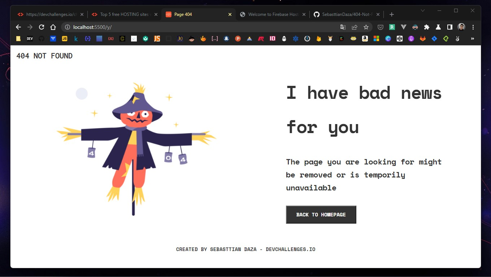

<!-- Please update value in the {}  -->

<h1 align="center">Page 404</h1>

   Solution for a challenge from  <a href="http://devchallenges.io" target="_blank">Devchallenges.io</a>.

  <h3>
    <a href="https://{[page404](https://page404-d56b2.web.app/)}">
      Demo
    </a>
     | 
    <a href="https://{[repoPage404](https://github.com/SebasttianDaza/404-Not-Found-Master#features)}">
      Solution
    </a>
     | 
    <a href="https://devchallenges.io/challenges/wBunSb7FPrIepJZAg0sY">
      Challenge
    </a>
  </h3>

<!-- TABLE OF CONTENTS -->

## Table of Contents

- [Table of Contents](#table-of-contents)
- [Overview](#overview)
  - [Built With](#built-with)
- [Features](#features)
- [Acknowledgements](#acknowledgements)
- [Contact](#contact)

<!-- OVERVIEW -->

## Overview

Website complete the project of challenge de Dev Challenge ❤️

- Where can I see your demo? [Here](https://page404-d56b2.web.app/)
- What was your experience?
    I learned a some about design responsive web with just HTML and CSS.
- What have you learned/improved?
    I learned more about CSS Grid and CSS Flexbox.
- Your wisdom? :)
    Is better learn with projects.
### Built With

<!-- This section should list any major frameworks that you built your project using. Here are a few examples.-->

- [HTML](https://developer.mozilla.org/en-US/docs/Web/HTML)
- [CSS](https://developer.mozilla.org/en-US/docs/Web/CSS)

## Features

<!-- List the features of your application or follow the template. Don't share the figma file here :) -->

This application/site was created as a submission to a [DevChallenges](https://devchallenges.io/challenges) challenge. The [challenge](https://devchallenges.io/challenges/wBunSb7FPrIepJZAg0sY) was to build an application to complete the given user stories.

## Acknowledgements

<!-- This section should list any articles or add-ons/plugins that helps you to complete the project. This is optional but it will help you in the future. For exmpale -->

- [Steps to replicate a design with only HTML and CSS](https://devchallenges-blogs.web.app/how-to-replicate-design/)
- [Node.js](https://nodejs.org/)
- [Marked - a markdown parser](https://github.com/chjj/marked)

## Contact

- Website [emprendeyourlifestyle](https://{[your-web-site-link](http://emprendeyourlifestyle.com/)})
- GitHub [@sebasttiandaza](https://{github.com/sebasttiandaza})
- Twitter [@SebasttianDaza](https://{twitter.com/SebasttianDaza})
